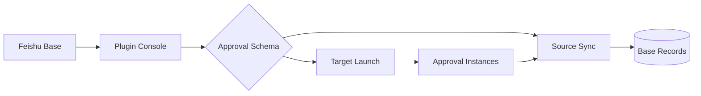

# Approval Base Studio

飞书审批与多维表格一体化工作台：可视化配置审批流、批量发起提审、定时同步审批实例，并自动归档审批附件。

## Highlights

- **双向审批流**：同时支持 Source 审批实例同步与 Target 审批发起。
- **可视化绑定**：自动识别审批 Schema，建立审批控件与多维表格字段映射。
- **定时同步**：应用身份后台轮询，按实例 Code 幂等更新 Base 记录。
- **附件归档**：下载审批签名附件，上传为 Base 附件并写入记录。
- **生产可用**：NestJS + React 全栈结构，类型检查、单元测试、ESLint 与生产构建齐备。

## Architecture



## Quick Start

1. 安装依赖：

   ```bash
   npm install
   ```

2. 配置环境变量。至少需要：

   ```bash
   FEISHU_APP_ID=
   FEISHU_APP_SECRET=
   PAYMENT_SESSION_SECRET=
   PAYMENT_BASE_TOKEN=
   PAYMENT_TABLE_ID=
   PROJECT_SYNC_TABLE_ID=
   RESOURCE_SYNC_TABLE_ID=
   PAYMENT_SYNC_TABLE_ID=
   CLOUD_SYNC_TABLE_ID=
   WALLET_SYNC_TABLE_ID=
   ```

3. 启动本地开发环境：

   ```bash
   npm run dev
   ```

## Production

```bash
npm run build:prod
npm start
```

后台同步默认每 60 秒执行一次，可通过环境变量调整：

```bash
SOURCE_SYNC_INTERVAL_SECONDS=60
```

## Quality Gates

```bash
npm run type:check
npm test
npm run eslint
```

## Scope

- 独立于既有线上付款应用，可单独发布与演进。
- 采用一流一表模型，多个审批流可归属同一个 Base。
- 不在仓库中保存生产密钥、用户 Token 或真实客户数据。
